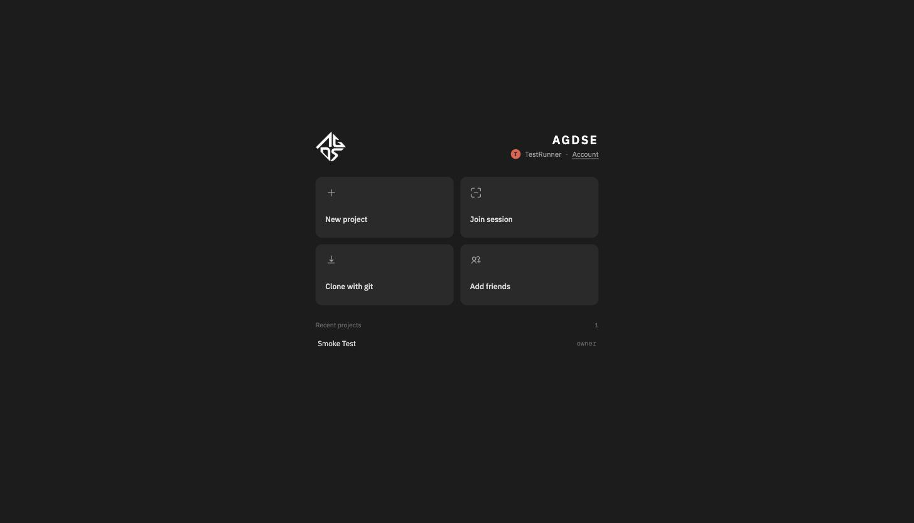
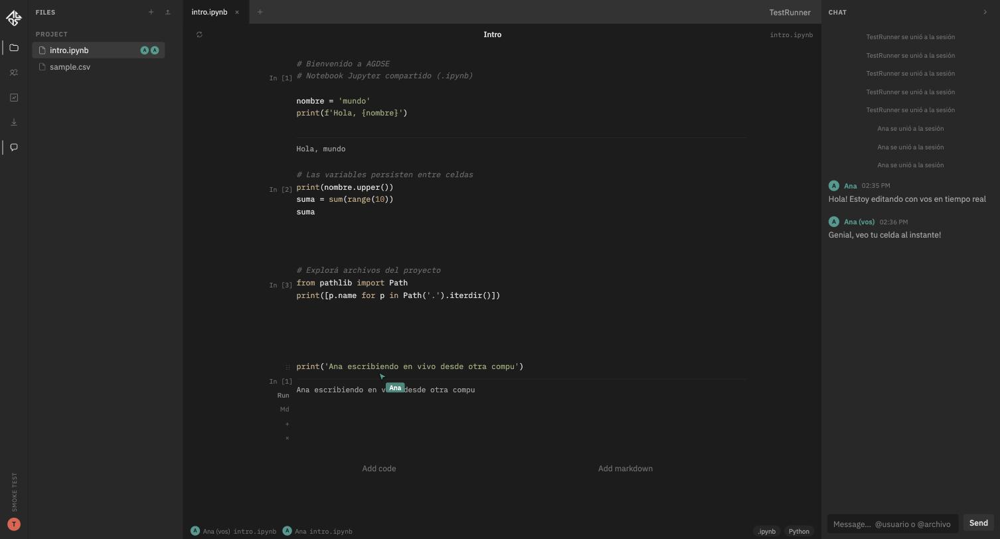
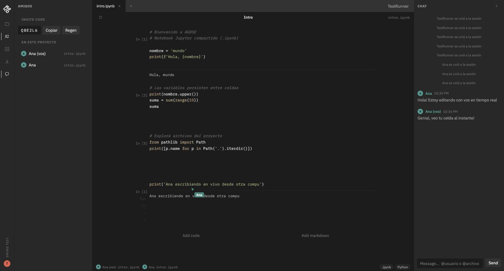
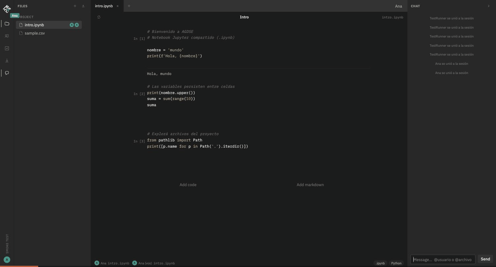

# AGDSE — Notebook compartido

Editor colaborativo sobre notebooks Jupyter (`.ipynb`) con proyectos, cuentas, amigos e invitaciones por código.

## Arrancar

```bash
python3 -m venv .venv
source .venv/bin/activate
pip install -r requirements.txt
python app.py
```

- Local: `http://127.0.0.1:5000`
- Red local: el link que imprime la consola (misma Wi‑Fi)

## Uso

1. Entrá como **Guest** (por defecto).
2. Unite a un proyecto con un **código de invitación**, o creá una **cuenta** (nombre, color, password).
3. Con cuenta: creá proyectos, agregá amigos e invitalos.
4. Al abrir un proyecto ves el editor de notebooks. La colaboración (cursores, chat, celdas) es solo dentro de ese proyecto.

Los archivos de cada proyecto viven en `projects/<id>/`. Cuentas y metadata en `data/`.

## Atajos

- `Ctrl/Cmd + Enter` en una celda: ejecutar
- Run / + / Eliminar en la barra de cada celda

## Capturas

**Pantalla de inicio** — entrás como Guest o con tu cuenta, y desde ahí creás proyectos o te unís a uno.



**Editor de notebooks** — celdas de código con su salida, chat del proyecto y cursores de los demás colaboradores en vivo.



**Invitación a un proyecto** — cada proyecto tiene un código de invitación para sumar colaboradores al toque.



## Demo: dos personas editando a la vez

El siguiente GIF muestra a dos usuarios (`TestRunner` y `Ana`) conectados al mismo proyecto desde dos sesiones distintas: uno manda un mensaje por el chat, agrega una celda y la ejecuta, y todo eso aparece al instante en la pantalla del otro, junto con su cursor en vivo.


